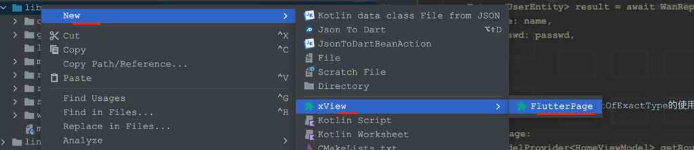

# we_flutter

flutter mvvm 开发模式

## Getting Started

dio 网络库二次封装，配置了Charles 代理抓包(可在main.dart内配置自己的地址和端口号)、PrettyLogger、RetryInterceptor、CookieManager、通用headers、统一异常处理、
JSON 根据泛型解析为对应的数据bean类

```
    //接口回调的方式
    WanRepository.fetchBanner<List<BannerEntity>>(
      cancelToken: _cancelToken,
      onSuccess: (List<BannerEntity> bannerList) {
        mBannerStateContorller.update((state) => bannerList);
      },
      onError: (int code, String message) {},
    );
    //又或者
    login(String name, String passwd) async {
        Future<UserEntity> result = await WanRepository.userLogin<UserEntity>(
            name: name,
            passwd: passwd,
        );
  }
```

ViewModel: 通过findAncestorWidgetOfExactType的使用，进行封装 ViewModelProvider
```
   //获取WidgetPage:
  static ViewModelProvider<HomeViewModel> getRoutePage(BaseRoutePage child) {
    return ViewModelProvider(viewModel: HomeViewModel(), child: child);
  }
```

状态管理，使用的是riverpod
```
接口请求数据状态更新：
mUserLoginStateController.update((state) => HttpResult<UserEntity>(state: HttpResultState.OnSuccess, data: userEntity));
```

配备了idea 插件一键生成 mvvm 代码模板: 见工程根目录下 flutter_mvvm_page.jar  下载安装到 idea plugins，
使用方式：在lib 的子级目录下 右键 new -> xView -> FlutterPage 点击即可生成 MVVM 模板代码，
封装了常用的代码，如 获取 page_router以及导航操作, 详见代码



demo 所用api 均为开源 玩android 平台接口， 自学两周简单实现 玩安卓 首页；
